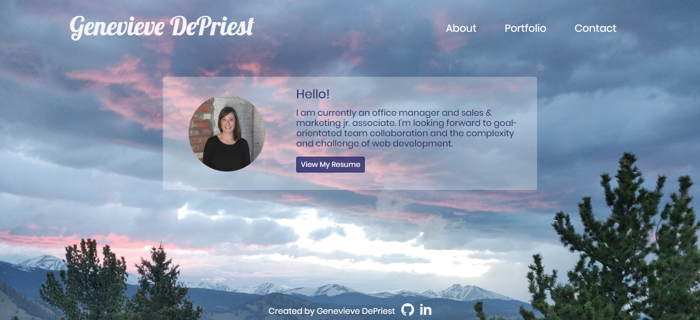

# Portfolio
This single-page portfolio uses a modal to display the dynamically added portfolio cards and contact-me form.  Each card on the portfolio displays a brief synopsis and is also a link to the project's site.  The submissions on the contact-me go to Firebase.

## Built With 🔧

* [Firebase](https://firebase.google.com) - database used.
* [Bootstrap](https://getbootstrap.com/) - css framework used.
* [JQuery](https://cdnjs.cloudflare.com/ajax/libs/jquery/3.2.1/jquery.min.js) - JavaScript library used.
 

## Authors ⌨️

* **Genevieve DePriest** - [gdepriest](https://github.com/gdepriest)

## Acknowledgments 🌟

* Amber Burroughs, Tutoring badass
* Lindsey, TA goddess
* Grace, TA goddess
* Sarah Cullen, Maestro
